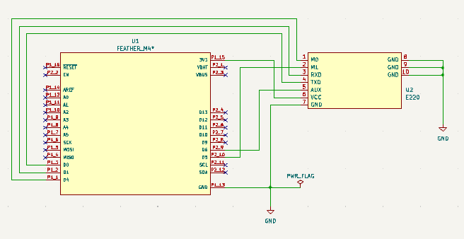
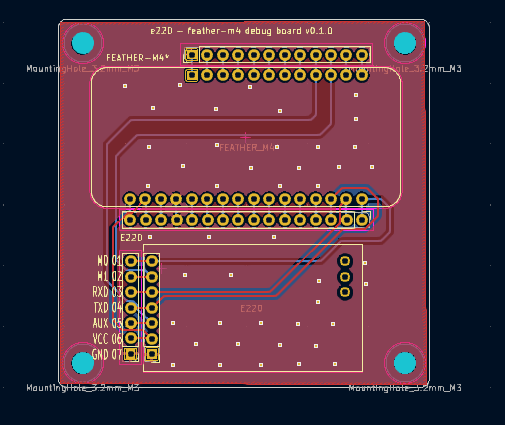

# E220 - Feather-m4 debug board

E220 - Feather-m4 debug board is a PCB that use for debugging with E220 and Feather-m4\*

\* Feather-m4-express or Feather-m4-can

## Circuit

See below the `kicad` folder for details.

  

## References

1. [Adafruit Feather M4 Express](https://www.adafruit.com/product/3857)
2. [Adafruit Feather M4 CAN Express](https://www.adafruit.com/product/4759)
3. [E220-900T22S（JP）-EV1](https://dragon-torch.tech/cat-components/rf-modules/e220-900t22s-jp-ev1/)

## License

This project is licensed under the MIT license.

## Author

Akifumi Kitabatake (a.k.a akif or akif999)
